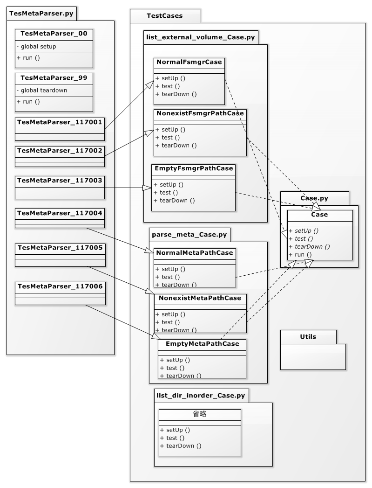

安裝 pyhcfs lib 於 docker 上並於 docker 上執行測試,
程式進入點 tests/functional_test/start_test_meta_parser.sh

以"tests/functional_test/start_test_meta_parser.sh"開始執行測試,步驟
1. 以 utils/setup_dev_env.sh 檢查環境
2. 呼叫 build.sh 產生 meta parser python lib 安裝檔
3. 呼叫 python tests/functional_test/TestCases/TestMetaParser/docker/startMetaParserDockerTest.py 啟動 docker
4. docker 內執行 tests/functional_test/TestCases/TestMetaParser/start_test_in_docker.sh 

docker 內腳本執行測試程式
tests/functional_test/TestCases/TestMetaParser/start_test_in_docker.sh
1. 安裝 meta parser library
2. 安裝測試必要 python 套件 （override）
3. 執行 tests/functional_test/pi_tester.py

測試資料
-	靜態測試資料（來源：事先從手機抓下來資料,先清除 TestCases/test_data 並於 test_meta_generator 內執行 python testMetaDataGenerator.py）
-	test_data 下以資料夾區隔每一資料夾內包含兩個檔案 如：690,meta_690
-	檔案 property 為手機上以 stat 指令取得的資料

Test architecture
 
