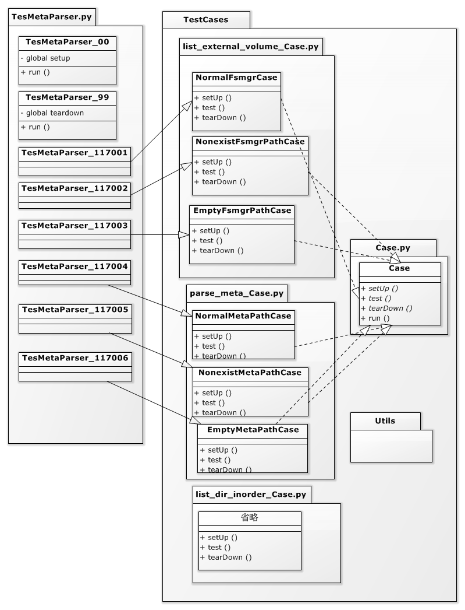

<!--
Copyright (c) 2021 HopeBayTech.

This file is part of Tera.
See https://github.com/HopeBayMobile for further info.

Licensed under the Apache License, Version 2.0 (the "License");
you may not use this file except in compliance with the License.
You may obtain a copy of the License at

    http://www.apache.org/licenses/LICENSE-2.0

Unless required by applicable law or agreed to in writing, software
distributed under the License is distributed on an "AS IS" BASIS,
WITHOUT WARRANTIES OR CONDITIONS OF ANY KIND, either express or implied.
See the License for the specific language governing permissions and
limitations under the License.
-->
TestCases package
- 將 test case 放在這個 package 內,test case 須名稱為 XXXCase.py.
- XXXCase.py 須登記在 __init__.py 內.
- XXXCase.py 內可含數個 case ,一個類別一個 case ,該類別須繼承 Case.py 內的 Case class
- Global setUp and tearDown 請實作於上一層 pi_tester.py 呼叫的 py 中的 00 and 99
- 須於上一層 pi_tester.py 呼叫的 py 中於對應測試編號的類別繼承 XXXCase.py 內的 case class 即可執行測試

Test architecture
 
